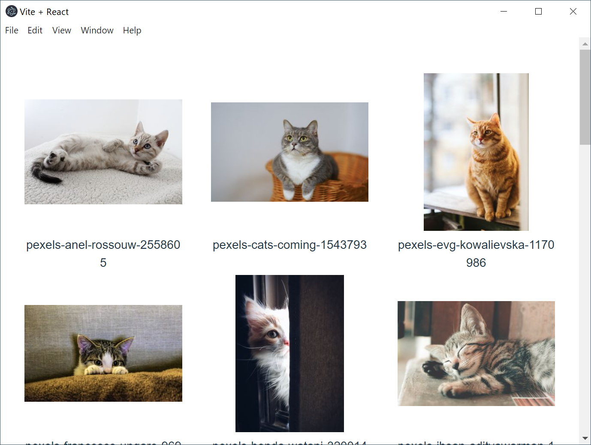

# media-manager




## 開発

### リポジトリ

```bash
git clone https://github.com/AsaiToshiya/media-manager.git
cd media-manager
npm install
```

### `config.json`

[`app.getPath('userData')`](https://www.electronjs.org/ja/docs/latest/api/app#appgetpathname) の場所に `config.json` を作成します。

config.json:

```bash
{
  "libraryPath": "/path/to/library"
}
```

### 実行

```bash
npm run dev
```


## メモ

アイコンには、[Material Design Icons](https://material.io/icons) を使用しています。


## ライセンス

MIT ライセンス。`LICENSE.txt` を参照。